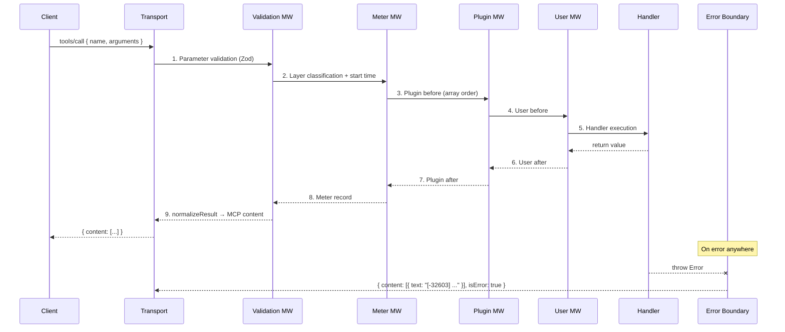
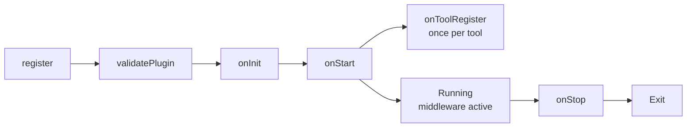
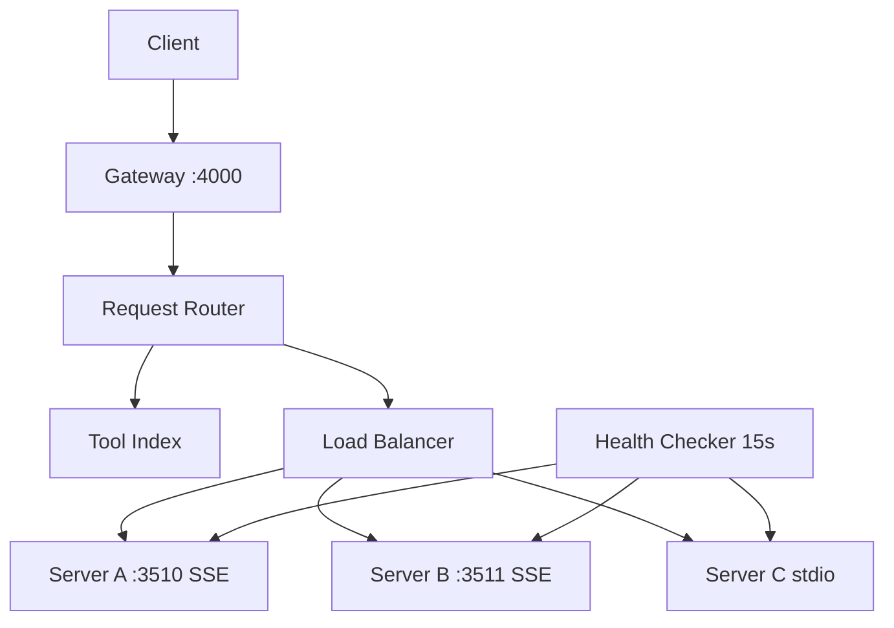

# Architecture

Internal structure and execution flow of air.

## Overall structure

```mermaid
graph TB
    Client[MCP Client<br/>Claude Desktop / Cursor / VS Code]
    Transport[Transport<br/>stdio | SSE | HTTP]
    Server[AirServer<br/>defineServer]
    Chain[Middleware Chain]
    Plugins[Plugin Manager]
    Tools[Tool Registry]
    Resources[Resource Registry]
    Storage[Storage<br/>MemoryStore | FileStore]
    Meter[Meter Middleware<br/>7-Layer Classification]

    Client --> Transport
    Transport --> Server
    Server --> Chain
    Server --> Plugins
    Server --> Tools
    Server --> Resources
    Plugins --> Chain
    Chain --> Tools
    Server --> Storage
    Server --> Meter
```

## Tool call flow



## Middleware chain

Onion model execution:

```
→ errorBoundary.before
  → validation.before (Zod)
    → meter.before (classify)
      → plugin[0].before (timeout)
        → plugin[1].before (retry)
          → plugin[2].before (cache — hit → abort)
            → user[0].before
              → handler()
            ← user[0].after
          ← plugin[2].after (cache — store result)
        ← plugin[1].after
      ← plugin[0].after (timeout — warning check)
    ← meter.after (record call)
  ← validation.after
← errorBoundary.after
```

### before hook return effects

```typescript
return undefined;                    // Continue to next
return { params: { ... } };          // Replace params
return { abort: true, abortResponse: '...' };  // Stop chain, respond immediately
return { meta: { key: 'value' } };   // Add metadata
```

### Error handling flow

```
Handler throws
  → plugin onError middleware (reverse order)
    → return value → convert to normal response
    → return undefined → pass to next
  → user onError middleware
  → errorBoundaryMiddleware (final catch)
    → AirError → MCP error code
    → plain Error → -32603 Internal Error
```

## Plugin lifecycle



## Transport layer

### Auto-detection (type: 'auto')

```
MCP_TRANSPORT env var?
  ├─ set → use that type
  └─ not set → process.stdin.isTTY?
                 ├─ false (piped) → stdio (client spawned)
                 └─ true (terminal) → http (developer running)
```

## Storage layer

```
createStorage({ type })
  ├─ 'memory' → MemoryStore (Map, lost on restart)
  └─ 'file' → FileStore
        ├─ .air/data/{ns}.json      (key-value)
        ├─ .air/data/{ns}.log.jsonl (append-only)
        ├─ In-memory cache per namespace
        ├─ Dirty tracking
        └─ 5s periodic flush (dirty only)
```

## Gateway architecture



Routing: client calls tool → Gateway checks Tool Index → Load Balancer selects server → proxy request → return result. Unhealthy servers auto-excluded, auto-restored on recovery.
