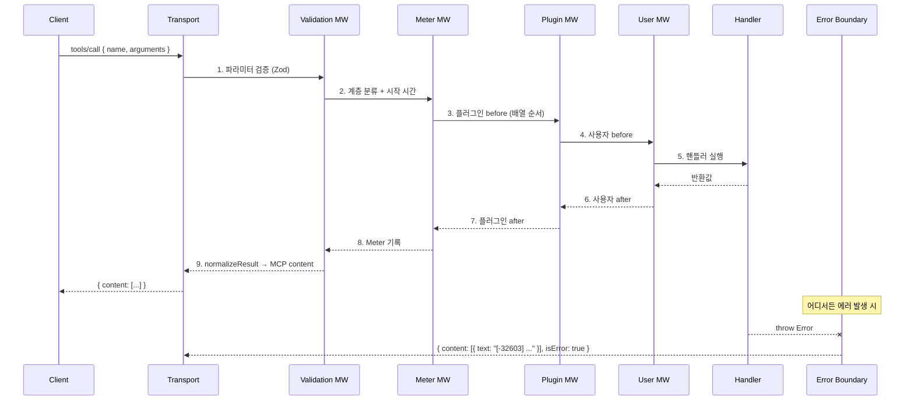
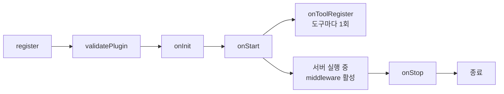
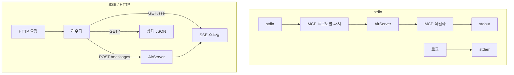
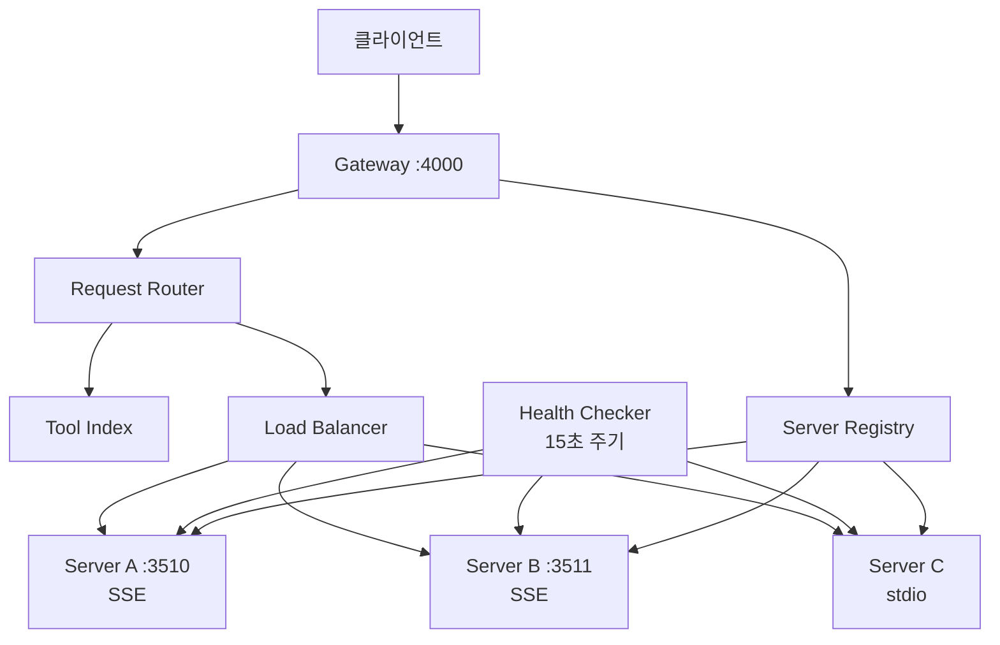

# 아키텍처

air의 내부 구조와 실행 흐름을 설명합니다.

## 전체 구조

```mermaid
graph TB
    Client[MCP 클라이언트<br/>Claude Desktop / Cursor / VS Code]
    Transport[트랜스포트<br/>stdio | SSE | HTTP]
    Server[AirServer<br/>defineServer]
    Chain[미들웨어 체인]
    Plugins[플러그인 매니저]
    Tools[도구 레지스트리]
    Resources[리소스 레지스트리]
    Prompts[프롬프트 레지스트리]
    Storage[스토리지<br/>MemoryStore | FileStore]
    Meter[Meter 미들웨어<br/>7계층 분류]

    Client --> Transport
    Transport --> Server
    Server --> Chain
    Server --> Plugins
    Server --> Tools
    Server --> Resources
    Server --> Prompts
    Plugins --> Chain
    Chain --> Tools
    Server --> Storage
    Server --> Meter
```

## 도구 호출 흐름

클라이언트가 도구를 호출하면 다음 순서로 처리됩니다:



## 미들웨어 체인

미들웨어는 양파(Onion) 모델로 실행됩니다:

```
→ errorBoundary.before
  → validation.before (Zod 검증)
    → meter.before (계층 분류)
      → plugin[0].before (timeout)
        → plugin[1].before (retry)
          → plugin[2].before (cache — 히트 시 abort)
            → user[0].before
              → handler()
            ← user[0].after
          ← plugin[2].after (cache — 결과 저장)
        ← plugin[1].after
      ← plugin[0].after (timeout — 경고 체크)
    ← meter.after (호출 기록)
  ← validation.after
← errorBoundary.after
```

### before 훅의 반환값 효과

```typescript
return undefined;                    // 다음 미들웨어로 진행
return { params: { ... } };          // 파라미터 교체 후 진행
return { abort: true, abortResponse: '...' };  // 체인 중단, 즉시 응답
return { meta: { key: 'value' } };   // 메타 데이터 추가
```

### 에러 처리 흐름

```
핸들러에서 throw
  → plugin onError 미들웨어 (역순)
    → 값 반환 시 → 정상 응답으로 전환
    → undefined 반환 시 → 다음으로 전달
  → 사용자 onError 미들웨어
  → errorBoundaryMiddleware (최종 포착)
    → AirError → MCP 에러 코드 변환
    → 일반 Error → -32603 Internal Error
```

## 플러그인 라이프사이클



### 실행 순서

1. **register**: `use` 배열 순서대로 플러그인 등록. `meta.name` 검증
2. **onInit**: DB 연결, 리소스 로드. `ctx.state`에 공유 객체 등록
3. **onStart**: 워커 시작, 주기적 작업 등록
4. **onToolRegister**: 각 도구 등록 시 호출. 도구 메타데이터 수정 가능 (동기)
5. **middleware**: 매 도구 호출마다 실행 (before → handler → after)
6. **onStop**: DB 닫기, 타이머 정리

## 트랜스포트 레이어



### 자동 감지 (type: 'auto')

```
MCP_TRANSPORT 환경변수?
  ├─ 있음 → 해당 타입 사용
  └─ 없음 → process.stdin.isTTY?
               ├─ false (파이프) → stdio (클라이언트가 spawn)
               └─ true (터미널) → http (개발자 직접 실행)
```

## 스토리지 레이어

```
createStorage({ type })
  ├─ 'memory' → MemoryStore
  │     └─ Map<namespace, Map<key, { value, expireAt }>>
  │
  └─ 'file' → FileStore
        ├─ .air/data/{namespace}.json      (key-value, JSON)
        ├─ .air/data/{namespace}.log.jsonl  (append-only, JSONL)
        ├─ 메모리 캐시 (네임스페이스별)
        ├─ Dirty 트래킹
        └─ 5초 주기 flush (dirty만)
```

## Gateway 아키텍처



### 요청 라우팅 흐름

1. 클라이언트가 도구 호출 → Gateway 수신
2. Tool Index에서 해당 도구를 제공하는 서버 검색
3. 같은 이름의 서버가 여러 개면 Load Balancer가 선택
4. 선택된 서버로 프록시 → 결과 반환
5. 서버 다운 → Health Checker 감지 → 라우팅 풀에서 제외
